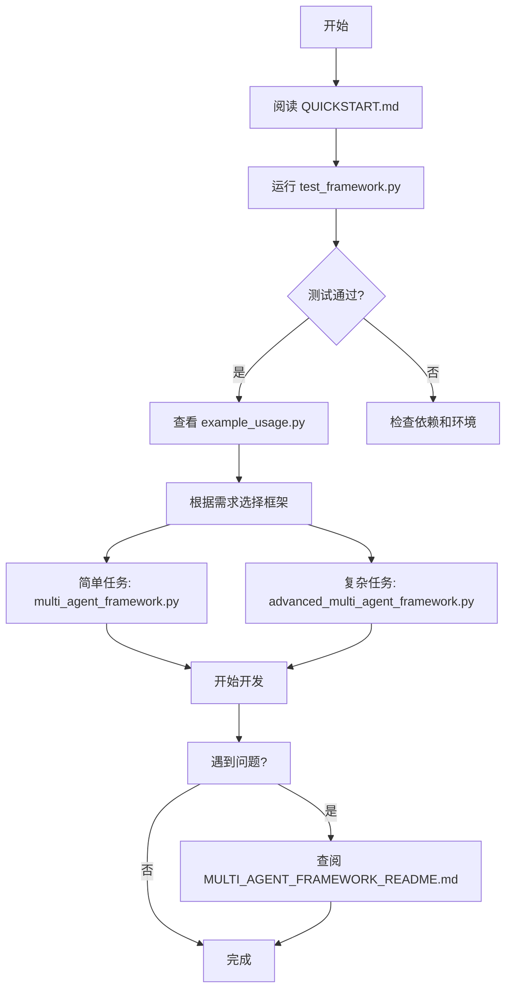

# 多智能体框架 - 文件索引

## 📁 核心框架文件

### 1. `multi_agent_framework.py` (505 行)
**基础多智能体框架**
- ✅ AgentFramework 核心类
- ✅ BaseAgent 抽象基类
- ✅ LLMAgent 和 ReactAgent 实现
- ✅ 三种工作流模式（流水线、监督者、并行）
- ✅ 动态智能体管理（注册/注销）
- ✅ 预定义智能体模板

**主要功能**:
```python
framework = AgentFramework()
framework.register_agent(agent)
result = framework.execute(task, workflow_type="pipeline", config={...})
```

---

### 2. `advanced_multi_agent_framework.py` (462 行)
**高级多智能体框架（基于 LangGraph StateGraph）**
- ✅ AdvancedAgentFramework 类
- ✅ 状态图工作流
- ✅ 条件分支和路由
- ✅ 循环迭代（反思模式）
- ✅ 记忆持久化
- ✅ 图可视化支持

**主要功能**:
```python
framework = AdvancedAgentFramework()
framework.build_reflection_graph("generator", "critic")
framework.compile()
result = framework.execute(task)
```

---

## 📚 文档文件

### 3. `MULTI_AGENT_FRAMEWORK_README.md` (345 行)
**完整使用文档**
- 📖 特性介绍
- 📖 安装指南
- 📖 详细 API 文档
- 📖 使用示例
- 📖 最佳实践
- 📖 常见问题

**适合人群**: 想要深入了解框架的用户

---

### 4. `QUICKSTART.md` (288 行)
**快速入门指南**
- 🚀 5分钟上手教程
- 🚀 常见场景速查
- 🚀 预定义智能体清单
- 🚀 自定义智能体步骤
- 🚀 快速参考表

**适合人群**: 初次使用的用户

---

### 5. `DESIGN_DOCUMENT.md` (464 行)
**设计文档**
- 🏛️ 设计理念
- 🏛️ 架构概览
- 🏛️ 核心组件详解
- 🏛️ 扩展指南
- 🏛️ 性能考虑
- 🏛️ 设计模式应用

**适合人群**: 想要扩展框架或深入理解设计的开发者

---

## 💻 示例和测试文件

### 6. `example_usage.py` (446 行)
**实用示例集**
包含 6 个完整示例：
1. ✅ 内容创作工作流
2. ✅ 代码审查工作流
3. ✅ 研究分析工作流（并行）
4. ✅ 监督者路由模式
5. ✅ 高级框架反思模式
6. ✅ 动态智能体管理

**运行方式**:
```bash
python example_usage.py
```

---

### 7. `test_framework.py` (134 行)
**快速测试脚本**
- ✅ 基础框架测试
- ✅ 自定义智能体测试
- ✅ 并行模式测试

**运行方式**:
```bash
python test_framework.py
```

---

## 📊 文件统计

| 文件类型 | 数量 | 总行数 |
|---------|------|--------|
| 核心代码 | 2 | 967 |
| 文档 | 3 | 1,097 |
| 示例/测试 | 2 | 580 |
| **总计** | **7** | **2,644** |

---

## 🎯 快速导航

### 我是新手，想快速上手
👉 阅读 `QUICKSTART.md`

### 我想了解所有功能
👉 阅读 `MULTI_AGENT_FRAMEWORK_README.md`

### 我想查看实际示例
👉 运行 `python example_usage.py`

### 我想扩展框架
👉 阅读 `DESIGN_DOCUMENT.md`

### 我想验证安装
👉 运行 `python test_framework.py`

---

## 🔗 与现有代码的关系

本框架参考了以下文件的设计模式：
- `0_langchain_multi_agent.py` - 流水线、监督者模式
- `1_deepagents_multi_agent.py` - 子智能体委派
- `2_react_agent.py` - ReAct 模式
- `3_plan_and_execute.py` - 规划执行模式
- `4_reflection_agent.py` - 反思循环模式
- `5_deepsearch_agent.py` - 深度搜索模式

**改进点**:
✅ 统一的接口设计  
✅ 动态智能体管理  
✅ 模块化架构  
✅ 完善的文档  
✅ 丰富的示例  

---

## 📦 依赖关系

```
multi_agent_framework.py
    ├── langchain
    ├── langchain-openai
    └── langgraph

advanced_multi_agent_framework.py
    ├── multi_agent_framework.py
    ├── langchain
    ├── langchain-openai
    └── langgraph

example_usage.py
    ├── multi_agent_framework.py
    └── advanced_multi_agent_framework.py

test_framework.py
    └── multi_agent_framework.py
```

---

## 🚀 使用流程建议



---

## 💡 核心价值

这个多智能体框架提供了：

1. **易用性** - 几行代码构建多智能体系统
2. **灵活性** - 随时添加/删除智能体
3. **可扩展性** - 轻松创建自定义智能体和工作流
4. **完整性** - 从基础到高级，满足各种需求
5. **文档完善** - 详细的文档和示例

---

## 📝 更新日志

### v1.0.0 (2026-04-25)
- ✅ 初始版本发布
- ✅ 基础框架实现
- ✅ 高级框架实现
- ✅ 完整文档和示例

---

## 🤝 贡献指南

欢迎贡献代码、文档或示例！

1. Fork 项目
2. 创建特性分支
3. 提交更改
4. 推送到分支
5. 创建 Pull Request

---

## 📄 许可证

MIT License

---

**最后更新**: 2026-04-25  
**维护者**: AI Assistant  
**联系方式**: 通过 Issue 反馈
